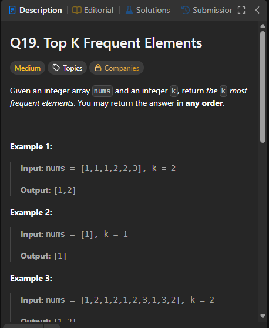
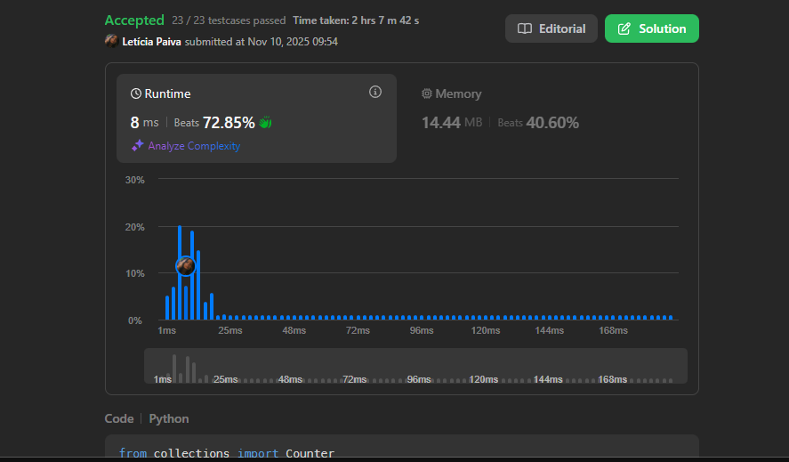
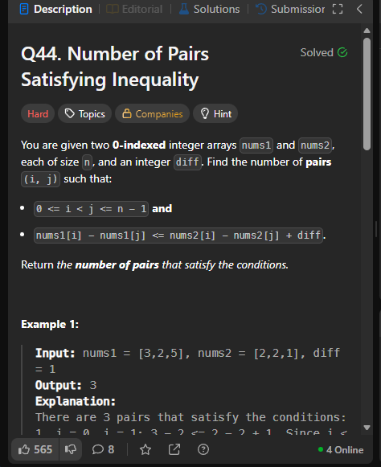
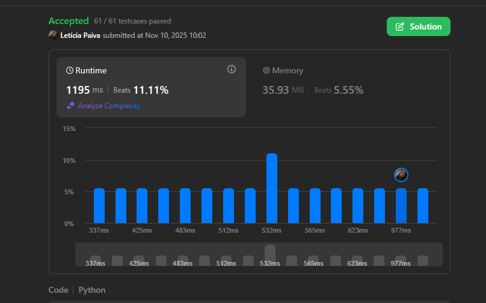

# Dividir e Conquistar

**Número da Lista**: 4 
**Conteúdo da Disciplina**: FGA0124 - PROJETO DE ALGORITMOS - T01  

## Alunos

<table>
  <tr>
    <td align="center">
      <a href="https://github.com/leticiakrpaiva">
        
         <b>Letícia Paiva</b>
      </a>
    </td>
    <td align="center">
      <a href="https://github.com/Yagoas">
        
         <b>Yago A.</b>
      </a>
    </td>
  </tr>
</table>

| Matrícula   | Aluno                        |
| ----------- | ---------------------------- |
| 22/1037803  | Letícia Kellen Ramos Paiva   |
| 19/0101091  | Yago Amin Santos             |

## Sobre

Foram escolhidos 4 exercícios da plataforma **LeetCode**, relacionados ao conteúdo de **Dividir e Conquistar**:

- **2 exercícios de nível difícil**  
- **2 exercícios de nível médio**  

A divisão foi feita da seguinte forma: cada integrante da dupla ficou responsável por **1 exercício de nível médio** e **1 exercício de nível difícil**.  

---

## Exercícios Resolvidos

# [Exercício 347](https://leetcode.com/problems/top-k-frequent-elements?envType=problem-list-v2&envId=divide-and-conquer)

**Nível:**  Médio 

## Descrição

## Solução

## Código
O código da solução está em [347.TopKFrequentElements.py](./exercicios/347.TopKFrequentElements.py).

# [Exercício 347](https://leetcode.com/problems/number-of-pairs-satisfying-inequality?envType=problem-list-v2&envId=divide-and-conquer)

**Nível:**  Díficil 

## Descrição

## Solução

## Código
O código da solução está em [Q44.NumberofPairsSatisfyingInequality.py](./exercicios/Q44.NumberofPairsSatisfyingInequality.py).

# [Exercício 621](https://leetcode.com/problems/task-scheduler/description/)

**Nível:**  Médio (Medium)

## Descrição

## Solução

## Código
O código da solução está em [exercício621.py](./exercicios/exercício.py).

# [Exercício 1383](https://leetcode.com/problems/maximum-performance-of-a-team/description/)

**Nível:**  Difícil (Hard)

## Descrição

## Solução

## Código
O código da solução está em [exercício1383.py](./exercicios/exercício.py).

##  Vídeo Apresentação

Neste vídeo, apresentamos a explicação e a solução dos exercícios escolhidos.

**Link do Vídeo:** [Clique aqui](https://youtu.be/njLSp18Zl-E)